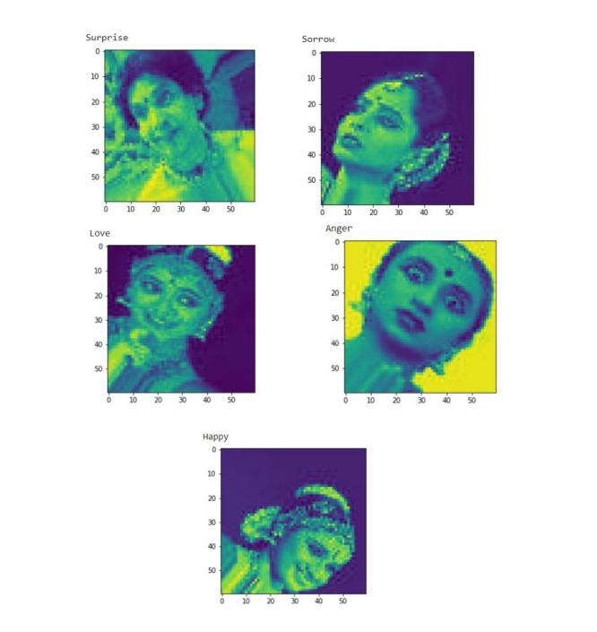

# Facial Expression detection of Bharatanatyam Dancers

## Table of contents

- [Overview](#overview)
  - [Links](#links)
- [My process](#my-process)
  - [Built with](#built-with)
  - [What I learned](#what-i-learned)
  - [Continued development](#continued-development)
  - [Useful resources](#useful-resources)
- [Author](#author)
- [Acknowledgments](#acknowledgments)

## Overview
This ia a project which i have implemented for my minor project.
Here we will be implementing the CNN Model for detecting the expression from dancers image.
The dataset provided here is self made dataset using the images from google and instagram.
They are cropped and labelled and then we used data augmentation to get a whole lot more of dataset.
The inital code written is for data augmentation.

### Screenshot

This is how the final output looks like.
It shows the image with the predicted output.

## My process

### Built with

- Python
- Deep Learning
- CNN Model
- pandas
- numpy
- matplotlib

### What I learned
During the initial stage I was not well versed in Deep Learning and found it incredibly difficult to come up with implementation. Later tried some of the similar projects, learnt implementing models, watched some more tutorials.
This is the project which taught me to take a step forward in asking favour from others who are good at it. I got a friend who lend me hand in developing this project.

### Continued development

Here, I have implemented this for only 5 expressions among 9 which are Anger, Happy, Love, Sorrow and Surprise. You can detect other expressions which are Courage, Disgust, Fear and Peace.
The dataset has already given for all these expressions. You can also try to increase the accuracy as we have achieved only 80% as of now.

### Useful resources

- [Example resource 1](https://towardsdatascience.com/applied-deep-learning-part-4-convolutional-neural-networks-584bc134c1e2) - This is an amazing article which helped me finally understand CNN Model in a better way. I really liked this pattern and will use it going forward.

## Author

- LinkedIn - [@manjari-u](https://www.linkedin.com/in/manjari-u/)
- Twitter - [@manjari_u](https://www.twitter.com/manjari_u)

## Acknowledgments
I really thank my guide Ranjitha ma'am for guiding us all along.
I also thank my team mates Lakshmi Supraja T and M M Krupashree who made this project successful and always bearing with me.
I would also like to extend my gratefulness to my friend Manjunath D who helped me lot more.
Thank you so much people.
**Note: Delete this note and edit this section's content as necessary. If you completed this challenge by yourself, feel free to delete this section entirely.**
